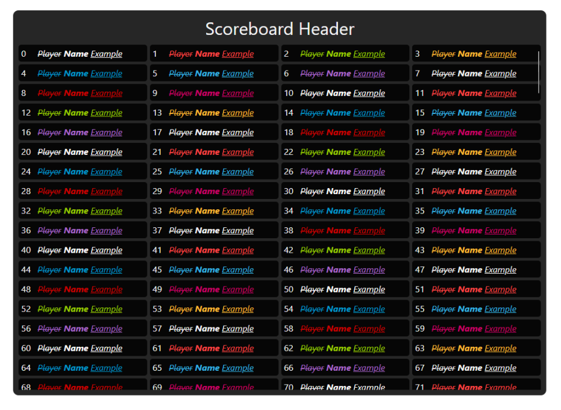

<h1 align="center">Svelte & Lua Scoreboard for CFX Servers</h1>

This was built using the Project Error Svelte & Lua Boilerplate

## Requirements
* [Node > v10.6](https://nodejs.org/en/)
* [Yarn](https://yarnpkg.com/getting-started/install) (Preferred but not required)

*A basic understanding of the modern web development workflow. If you don't 
know this yet, Svelte might not be for you just yet.*

## Getting Started

First clone the repository or use the template option and place
it within your `resources` folder

### Installation

*The boilerplate was made using `yarn` but is still compatible with
`npm`.*

Install dependencies by navigating to the `web` folder within
a terminal of your choice and type `npm i` or `yarn`.

## Features

Basic scoreboard design


## Development Workflow


**Hot builds**
When developing in-game you can use the hot build system by running
the `dev:game` script. This will write changes to disk meaning all
that is required is a resource restart to update the game script.

For development in browser you can just run `dev` instead.

**Usage**
```sh
# yarn
yarn dev
# npm
npm run dev
```

**Production Builds**

When you are done with development phase for your resource. You
must create a production build that is optimized and minimized.

You can do this by running the following:

```sh
npm run build
yarn build 
```